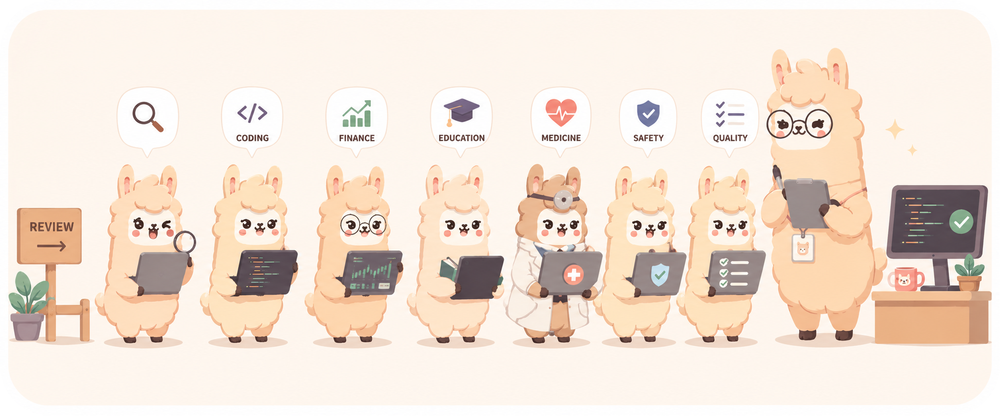
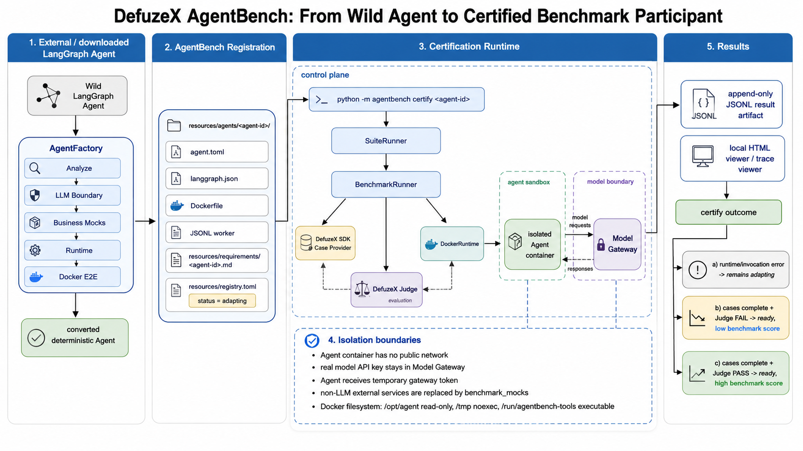

# AgentBehaviorBench (ABB)

> **Before you run ABB:** install Python 3.10+, Docker Desktop or Docker
> Engine (running). The KUMA evaluation image installs its SDK from PyPI. The bundled
> ReAct research Agent needs `KUMA_API_KEY` (or `DEFUZEX_API_KEY`),
> `OPENROUTER_API_KEY`, `OPENROUTER_MODEL`, and `TAVILY_API_KEY`.

<p align="center">
  
</p>

<p align="center">
  English |
  <a href="docs/otherLanguages/README.fr.md">Français</a> |
  <a href="docs/otherLanguages/README.ja.md">Japanese</a> |
  <a href="docs/otherLanguages/README.zh-CN.md">Simplified Chinese</a> |
  <a href="docs/otherLanguages/README.zh-TW.md">Traditional Chinese</a> |
  <a href="docs/otherLanguages/README.ko.md">한국어</a>
</p>

<p align="center">
  
  
  
</p>

AgentBehaviorBench runs registered AI agents in isolated runtimes, captures
their execution evidence, and evaluates the result through a selectable SDK.
SDK adapters are discovered from directories under `agentbench/sdk/plugin/`. With
one adapter it is selected automatically; with several, choose `--sdk NAME`.
This checkout currently includes KUMA. Results are written locally and can be
inspected in ABB's browser viewer.

ABB owns Agent selection, containers, concurrency, observation and local results.
Kuma owns the Case/Input/Submission/Report contract and calls the DefuzeX service
for official scenario generation and judging. A Case tests behavior in a scenario;
its Judge report is not a general intelligence score. A behavioral `issue` is a
completed evaluation finding. An invocation or evidence failure is recorded separately.

## Quick start

From the repository root, create a virtual environment and install ABB:

```bash
python3 -m venv .venv
source .venv/bin/activate              # Windows PowerShell: .venv\Scripts\Activate.ps1
python -m pip install --upgrade pip
python -m pip install -e "."
agentbench sdk list                   # Should list kuma without requiring credentials.
```

Try the complete local flow before configuring accounts:

```bash
python -m examples.offline_demo --output results/offline-demo.json
```

This runs an echo Agent and deterministic local Judge without Docker, credentials,
or network. The `OFFLINE_RESULT=` line identifies the saved file. It demonstrates
the harness and viewer format; it does not test the official Kuma service.

KUMA's adapter lives in `agentbench/sdk/plugin/kuma/`. Its evaluation image
installs `kuma-defuzex[otel]==0.2.4` from PyPI, as declared in the adapter's
`requirements.txt`; no local SDK source checkout is required. The distribution
is named `kuma-defuzex`, while Python code imports `kuma`.

Create the local environment file and add the required credentials:

```bash
cp .env.example .env                   # Windows PowerShell: Copy-Item .env.example .env
```

```dotenv
# Required when using the KUMA evaluation SDK. DEFUZEX_API_KEY is accepted too.
KUMA_API_KEY=

# Required for model calls made by Docker-based Agents.
OPENROUTER_API_KEY=
OPENROUTER_MODEL=openai/gpt-4.1-mini

# Required by the ReAct and Company Research Agents for web research.
TAVILY_API_KEY=
```

Install [Docker for your platform](https://docs.docker.com/get-started/get-docker/)
and start it. Check `docker info` before running an Agent. The checked-in registry
currently enables five Agents. ReAct and GPT Researcher are `ready`;
TradingAgents, Waku Agent and Article Explainer are `adapting`. Company Research
remains disabled. Evaluate an adapting Agent and certify it only after its native
deployment requirements are satisfied:

```bash
agentbench evaluate trading-agents --cases 1 --max-steps 1
agentbench certify trading-agents
```

Certification requires successful execution and accepted evidence for every Case;
a Judge finding does not prevent readiness. Once certification makes it `ready`,
run every enabled ready Agent:

```bash
agentbench run
```

ABB asks you to confirm the selected Agents, saves a result snapshot under
`results/`, and starts the local viewer. Use `--yes --no-view` for a non-interactive
or headless run:

```bash
agentbench run --yes --no-view --output results/benchmark.json
```

To execute up to four Cases at once, set this single value in `.env`:

```dotenv
ABB_MAX_PARALLEL_CASES=4
```

The default is `1`. Cases from the same Agent can run together: one Agent with
four Cases can use all four workers. Across several Agents, the shared pool
never exceeds the configured Case limit. Inputs within one Case remain ordered.
ABB prepares each Agent's Case collection once, then gives each Case its own
runner, container session, working files, trace identity, and result.

The startup line shows the actual pool size, for example
`Case workers: 4 (configured: 4)`. Image caching and build coordination are
internal. Each Case keeps its own status, and final results are ordered by
Agent registration then Case index. Ctrl+C cancels active work, retains finished
Case results, and records cancelled or skipped Cases explicitly.

Directory SDK runs also retain a fixed plan and immutable Case files under
`results/suites/<suite-id>/` (or `suites/` beside a custom output base). Reopen the
printed `events.json` path to view all Cases and their attempt histories together.
The viewer can continue unfinished work or retry an eligible Case; its partial
report includes completed results even while other Cases are blocked.

```bash
agentbench resume results/suites/<suite-id>/events.json
agentbench retry results/suites/<suite-id>/events.json --agent react-agent --case 3
```

Completed Judge findings are retained, including `issue`; they are not retried
until a passing verdict appears. Safe transient execution failures have at most
two automatic retries by default. `--case-retries 0` disables these, and
`--retry-delay` sets the initial backoff for run/evaluate/certify. Unknown accepted
requests and unconfirmed cleanup remain blocked instead of duplicating work.
See [recovery behavior and module boundaries](docs/Suite-Recovery-Implementation.md)
and [reusing Cases after changing code or model](docs/Case-Reuse-Commands.md).

Concurrent execution requires an SDK adapter supporting independent Case
execution and cancellation. Python callers pass
`ConcurrencySettings(max_parallel_cases=4)` to `SuiteRunner`; the library does
not implicitly load a dotenv file.

See the [Case concurrency design](docs/Case-Concurrency-Design.md) and
[implementation guide](docs/Case-Concurrency-Implementation.md) for interfaces,
changed files, worker/image/container counts, result shape, and validation.

## Requirements and environment

| Requirement | Why it is needed |
| --- | --- |
| Python 3.10 or newer | ABB host CLI and harness. |
| Docker Desktop / Docker Engine | Docker Agents need a running engine before `run`, `evaluate`, `certify`, or `observe`. The offline demo does not. |
| `KUMA_API_KEY` or `DEFUZEX_API_KEY` | Case and Judge access when using the KUMA SDK. |
| `OPENROUTER_API_KEY` | Model traffic from Docker Agents is routed through ABB's interceptor to OpenRouter. |
| `OPENROUTER_MODEL` | Required model slug. `.env.example` contains an example value, not an implicit runtime default. Choose one your account can use. |
| `TAVILY_API_KEY` | Web-search credential for ReAct and Company Research. |

`.env` is ignored by Git. Environment variables already exported by the shell
override values in `.env`; `--env-file PATH` selects another dotenv file; and
`--model MODEL` overrides `OPENROUTER_MODEL` for one command.

Get model credentials from [OpenRouter keys](https://openrouter.ai/settings/keys),
and search credentials from the [Tavily dashboard](https://app.tavily.com/).
For Kuma credentials, follow the [official API key guide](https://github.com/DefuzeX-AI/KUMA-DefuzeX/blob/main/docs/sdk-guide.md#api-key)
and obtain an account key from your DefuzeX service administrator if none was issued.
ABB selects non-empty `KUMA_API_KEY` first, then `DEFUZEX_API_KEY` (an ABB alias),
and passes it explicitly to Kuma. A host SDK credential file is not mounted into
the container. Never put keys in CLI arguments, committed profiles, or reports.

The optional variables below are only needed when you want to identify
OpenRouter requests or use a compatible endpoint:

```dotenv
OPENROUTER_BASE_URL=https://openrouter.ai/api/v1
OPENROUTER_HTTP_REFERER=https://example.com
OPENROUTER_APP_TITLE=AgentBehaviorBench
```

## Included Agents

| Agent | Configured scope | Readiness |
| --- | --- | --- |
| ReAct | Native Tavily search and iterative reasoning | Ready in the checked-in registry; real execution artifacts retained. |
| TradingAgents | Market analysis with Yahoo Finance; no order execution | Enabled and adapting; the current native entrypoint and input contract require certification. |
| GPT Researcher | Academic research with NCBI retrieval and local CPU embeddings | Ready in the checked-in registry; real execution artifacts retained. |
| Company Research | Existing company research unit | Disabled; retained status is not current acceptance evidence. |
| Waku Agent | Native personal-assistant loop, Case-local memory and constrained local tools | Enabled and adapting; source and offline boundary verified, live model/tool evidence pending. |
| Article Explainer | Native five-specialist compiled swarm | Enabled and adapting; live model/handoff evidence pending. |

Check `resources/registry.toml` for the current status and the
[campaign ledger](docs/Benchmark-Campaign-Ledger.json) for measured execution
coverage. Readiness validates the configured binding; it does not guarantee a
passing Judge verdict for every generated Case. The Waku and Article onboarding evidence,
source pins and remaining blockers are recorded in
[the 2026-09-14 onboarding report](docs/New-Agent-Onboarding-2026-09-14.md).

## CLI

Run `agentbench --help` or any command with `--help` for the installed CLI.
The most useful commands are:

| Command | Use |
| --- | --- |
| `agentbench run` | Evaluate every enabled `ready` Agent with the selected SDK. This is the default command. |
| `agentbench agent add https://github.com/owner/repository` | Download source into the next numbered Agent folder and print a JSON array of setup files. |
| `agentbench evaluate react-agent --cases 1` | Evaluate one enabled Agent on a chosen number of independent Cases. |
| `agentbench observe react-agent` | Run one enabled Agent with native input and save traces, without creating Cases or calling a Judge. |
| `agentbench certify react-agent` | Run an `adapting` Agent and promote it to `ready` only after certification succeeds. |
| `agentbench view results/benchmark.json` | Reopen a saved benchmark result in the local viewer. |
| `agentbench resume SUITE` | Continue unfinished slots using saved Cases and original request state. |
| `agentbench retry SUITE --agent ID --case N` | Explicitly recover one unfinished Case; numbers start at 1. |
| `agentbench reuse SUITE` | Start a linked new evaluation using the same Cases under the current code. |
| `agentbench sdk list` | List adapter directories without importing SDK implementations. |
| `agentbench clean --dry-run` | Show the local result history that would be moved to a recoverable archive. |

To begin onboarding a new Agent:

```bash
agentbench agent add https://github.com/owner/repository
```

Source is downloaded to `resources/agents/NN-repository/agent/`, using one more
than the largest existing directory number (`09` is followed by `10`). The outer
`source-manifest.json` records the repository URL and exact commit. Existing
Agent folders are never overwritten. Use `--agents-dir PATH` to select another
parent directory.

Standard output contains a sorted JSON array of paths relative to `agent/`:
LangGraph configs and their Python entrypoints, dependency files, Docker files,
README files and environment examples. Download status goes to standard error.
This first onboarding step does not import the downloaded code, install its
dependencies, generate benchmark configuration, or add an incomplete entry to
`resources/registry.toml`.

Each configured Agent keeps its SDK evaluation specification in the outer
`requirement.md`. For KUMA, this document must follow the Agent Profile format:
YAML front matter and the required production-scenario, behaviors-to-test and
limitations sections. Case generation passes this exact file through
`agent_profile_path`; there is no separate `evaluation/profile.md`. Referenced
input schemas can remain under `evaluation/`, with paths relative to
`requirement.md`. The BBA input-delivery contract remains at
`evaluation/input-contract.json`.

Useful `run` options:

```bash
# Use an explicit model for this run.
agentbench run --model openai/gpt-4.1-mini

# Select a discovered adapter directory and pass it a JSON options file.
agentbench run --sdk kuma --sdk-options sdk-options.json

```

To add an SDK, create an adapter package with a `plugin.py` entry under
`agentbench/sdk/plugin/`; no central name list or package entry-point registration is
needed. See [the SDK adapter guide](docs/SDK-Directory-Adapters.md) for the
interface, dependency rules, Python usage, and verification commands.

See [the CLI reference](docs/CLI.md) for the complete command and option
reference, and [the agent onboarding guide](docs/How%20To%20Add%20Agent.md) to
add another Agent.

See [troubleshooting and result interpretation](docs/Troubleshooting.md) for
configuration, network, trace, Judge and exit-code failures, or the
[Chinese operation guide](docs/Guide.zh-CN.md).

## Overview

ABB is designed to make Agent evaluation reproducible. An Agent is declared in
the registry, adapted to ABB's runtime contract, evaluated with an SDK, and
saved with inspectable execution evidence. Agents progress from `adapting` to
`ready` only through the certification flow.

The execution path is:

```text
resources/registry.toml
        -> CLI selection
        -> SuiteRunner / evaluation SDK
        -> Agent adapter and runtime
        -> result snapshot and local viewer
```



## Repository layout

- `resources/registry.toml` declares each Agent, its status, and its runtime.
- `resources/agents/` contains each Agent unit and its ABB configuration.
- `agentbench/cli/` provides the terminal commands.
- `agentbench/harness/` owns suite execution, results, and registry loading.
- `agentbench/runtime/` runs Agents locally or in Docker and intercepts model
  traffic for Docker runtimes.
- `agentbench/services/` contains runtime services shipped with AgentBench,
  including the Model Interceptor Docker build context.
- `agentbench/sdk/plugin/` contains SDK adapter packages, shared contracts, and directory discovery.

## Development

Run the test suite after installing development dependencies:

```bash
python -m pytest
```

For repository conventions, see [AGENTS.md](AGENTS.md).

## License

MIT. See [LICENSE](LICENSE).
