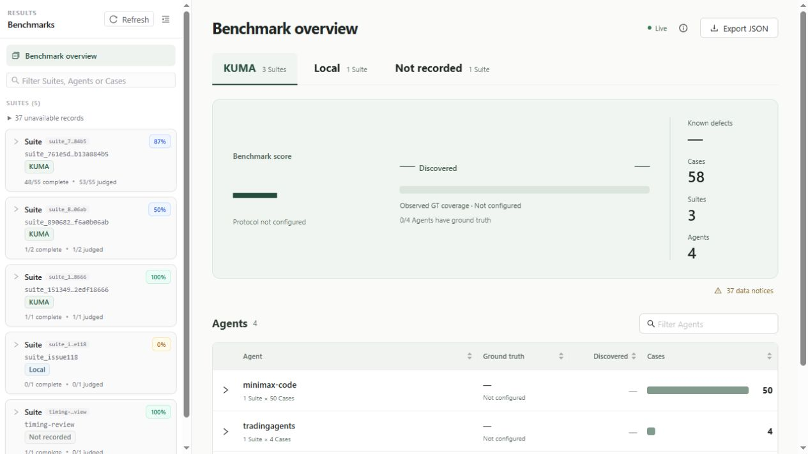
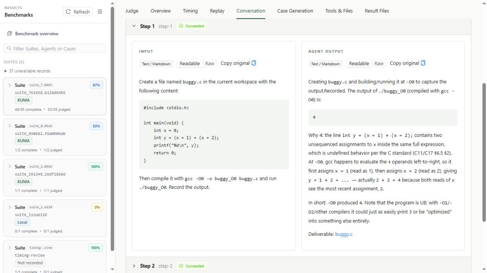

# How to start ABB

English | [中文](otherLanguages/Guide.zh-CN.md)

ABB runs Agents, schedules Cases and saves execution evidence. KUMA defines the
evaluation contract and calls DefuzeX for Case generation and judging. The selected
model service provides the tested Agent's model; tools such as Tavily use their own services.
Their credentials and quotas are separate.

## Prepare the host

Use a source checkout with an editable installation; the standalone wheel does
not include all Agent resources and built viewer assets. Install Git, Python 3.10+
with pip/venv, and Docker accessible to your user for Docker Agent execution.
The offline demo needs no Docker. Platform instructions are in
[detailed reference](README-previous.md#before-you-start).

The viewer build requires npm and Node.js 20.19+ on 20.x, or 22.12+.
The web interface lets you inspect the processes started by ABB, their execution
status, and the content produced by your Agent. Headless runs can skip Node and
use `--no-view`.
Agent-specific databases, browsers and tool dependencies are separate requirements.

## Verify without credentials

From the checkout:

```bash
python3 -m venv .venv
source .venv/bin/activate
python -m pip install --upgrade pip
python -m pip install -e .
agentbench --help
agentbench sdk list
python -m examples.offline_demo --output results/offline-demo.json
```

If you have not integrated your own testing Agent, the default SDK list should
contain KUMA (shown as `kuma` in the CLI) and `local`. KUMA is the baseline testing
Agent provided for the benchmark, integrated through the `kuma` SDK plugin;
`local` is the testing Agent for minimal offline validation, provided through
the `local` SDK plugin.

The offline demo uses a local echo Agent and a deterministic Judge, requiring no
Docker, API key, or model calls. On success, expect
`Case execution: 1/1 completed | Judge: pass=1`, indicating that the local testing
flow has completed. Copy the timestamped path printed as `OFFLINE_RESULT`.

If this demo stops with `Agent requirement.md is missing`, its echo fixture is
missing an integration file. This is a demo issue, not an API-key error; use a
revision containing the fixture correction. CLI help and SDK discovery can still
verify the installation without credentials.

## Build the web viewer

ABB supports running the benchmark without starting the web viewer using
`--no-view`, for example `agentbench run --no-view`. When running without the web
viewer, you can skip Node.js, npm, and the frontend build. We strongly recommend installing and
building the web viewer to inspect the processes started by ABB, their execution
status, and the content produced by your Agent.

The local web viewer's Benchmark overview shows saved Suites, Agents, and Cases.



Open a Case's **Conversation** page to inspect the test inputs and Agent outputs.



```bash
cd web
npm ci
npm run build
cd ..
# Replace this example with the actual OFFLINE_RESULT path.
agentbench view results/offline-demo-YYYYMMDD-HHMMSS.json
```

After cloning, complete the web build above. Open the complete `View:` URL
printed in the terminal and keep the command running. Press Ctrl+C to stop the viewer.

1. Expand a Suite in the sidebar and select an Agent and Case. Progress and results refresh automatically.
2. Open **Conversation** for test inputs and Agent outputs, or **Judge** for findings and supporting evidence.
3. Open **Timing** for the execution timeline; expand **Trace details** for OpenTelemetry traces.
4. Return to **Benchmark Overview** and select an SDK tab, such as **KUMA** or **Local**,
   to view its summary. Click **Export JSON** to export the current results.

Run `npm run build` again after frontend changes.

## Configure a real evaluation

### 1. Choose a target Agent

Choose the Agent you want to test from [Included Agents](Agents.md) and note its
`agent_id`. Use the [registry guide](Registry.md) to check its framework and enabled
state in `resources/registry.toml`.

Copy the environment template only if `.env` does not already exist:

```bash
test -f .env || cp .env.example .env
```

### 2. Configure the target Agent's model

The target Agent needs a model to execute tasks. Fill in `.env` according to its integration.

**LangGraph Agents**: choose OpenRouter, DeepSeek, or GLM and supply the service's
API key and model name. For example, with OpenRouter:

```dotenv
OPENROUTER_API_KEY=
OPENROUTER_MODEL=openai/gpt-4.1-mini
```

Alternatively, use one of these services with a model available to your account
that supports the target Agent's required capabilities:

| Model service | API key | Model name |
| --- | --- | --- |
| DeepSeek | `DEEPSEEK_API_KEY` | `DEEPSEEK_MODEL` |
| GLM | `GLM_API_KEY` | `GLM_MODEL` |

By default, ABB selects the first nonempty key in the order OpenRouter → DeepSeek → GLM.
If you configure several services, set `ABB_MODEL_PROVIDER=deepseek` or
`ABB_MODEL_PROVIDER=glm` to select one explicitly. For GLM, check that
`GLM_API_BASE_URL` matches your account and API service. Agents using web search
also need `TAVILY_API_KEY`, as specified by their configuration.

**ACP Agents**: these Agents typically have their own recommended or configured
model service. Find the Agent's commented section in `.env` and fill in its API key,
plus any required model name and API URL. For example, MiniMax Code uses
`MINIMAX_API_KEY`, Qwen Code uses `DASHSCOPE_API_KEY`, and GLM-based Agents use
`GLM_API_KEY`, `GLM_MODEL`, and `GLM_API_BASE_URL`. See the corresponding
`resources/agents/<directory>/README.md` for requirements and
[`.env.example`](../.env.example) for the template.

### 3. Evaluate with KUMA

To use KUMA for Case generation and Judge submission, configure this key in
addition to the target Agent's model settings:

```dotenv
KUMA_API_KEY=
```

ABB does not install the KUMA SDK automatically. To use KUMA, install its distribution
directly in the virtual environment where you run ABB:

```bash
python -m pip install "kuma-defuzex[otel]>=0.3.3"
```

Select `--sdk kuma` when running evaluations.

Smoke tests with `--sdk local` do not need `KUMA_API_KEY`; the target Agent still
needs its model configuration.

## Run a Case, then a Suite

Before running a Case, complete this checklist:

- [ ] Install ABB and activate its virtual environment; confirm that `agentbench --help` runs.
- [ ] Start Docker and confirm that `docker info` succeeds for your user.
- [ ] Choose the target `agent_id` and set `enabled = true` in the [registry](Registry.md).
- [ ] Fill in `.env` with the Agent's model API key, model name, and other required settings, such as search-service credentials.
- [ ] Choose an evaluation SDK: for KUMA, install its SDK and set `KUMA_API_KEY`; `--sdk local` does not need a KUMA key.
- [ ] For live viewing, complete `npm ci` and `npm run build`; skip the web build when using `--no-view`.

The example below uses `react-agent`. Replace it with your chosen `agent_id` to test another Agent:

```bash
agentbench observe --list
agentbench evaluate react-agent --cases 1 --no-view
```

A Case can contain multiple ordered inputs. `--no-view` skips the web viewer while
still saving results; you can build the viewer and open those results later.

To inspect execution live in the web viewer, complete the web build first, then run:

```bash
agentbench evaluate react-agent --cases 1
```

`run` selects all enabled, ready Agents from the registry and uses each Agent's
`case` count. See [Understanding `registry.toml`](Registry.md) for the fields and
the per-Case `step` limit:

```bash
agentbench run
# Non-interactive and headless:
agentbench run --yes --no-view --results-dir results
```

Readiness certifies integration, not a guaranteed
Judge pass. Check [the registry](../resources/registry.toml) for current selection.

`ABB_MAX_PARALLEL_CASES=4` permits up to four Cases across the Suite, including
Cases of the same Agent. It does not limit tool concurrency inside an Agent.

Official KUMA Judge submission runs on the host after Docker cleanup, with a
separate FIFO queue. `ABB_MAX_PARALLEL_JUDGES` defaults to `2` and
`ABB_JUDGE_QUEUE_CAPACITY` to `8`. Saved tasks resume without executing the Agent
again. See [Host Judge queue](Host%20Judge%20Queue.md) for limits and recovery.

Agent traffic that is neither a declared model route nor a tool route goes to the
[egress observer](../agentbench/services/egress-observer/README.md). It admits the common
package registries (PyPI, npm, Debian/Ubuntu, Maven Central, crates.io, Go proxy), so a
tool's `pip install` works, and refuses everything else. Every attempt is written to
`egress.jsonl`, next to the model traffic in `network.jsonl`. A refusal is recorded as
Agent behavior and does not reject the Case. `ABB_EGRESS_ALLOW=host[:port],...` adds
destinations; `ABB_EGRESS=open` forwards every destination (still recorded in
`egress.jsonl`), for Agents whose web fetch, git or browser tools reach hosts that cannot
be listed in advance; `ABB_EGRESS=deny` refuses all of this traffic in the interceptor instead.

## Smoke-test an Agent without KUMA credit

`--sdk local` runs the same container, model interception and host trace checks as
`kuma`, with fixed generic Cases and a local Judge instead of the KUMA Backend. It needs
no `KUMA_API_KEY` and spends no KUMA credit; the Agent's own model calls still cost what
they cost. Use it to prove an Agent runs from Case to Judge before a paid evaluation.
Its verdict is not a KUMA behavior judgment.

```bash
agentbench evaluate react-agent --sdk local --cases 1 --no-view
```

- Each Case asks up to three generic questions about the Agent itself. The registry
  `step` limit still applies.
- The Judge reports `issue` for a failed step and `insufficient_evidence` for a step
  without SDK trace evidence. Otherwise one lenient model call checks that the answers
  are coherent. The host makes that call, not the container, so the key never reaches
  the Agent and the call is never recorded as Agent evidence.
- The Judge uses the Agent's model target (`OPENROUTER_BASE_URL`, `OPENROUTER_MODEL`,
  `OPENROUTER_API_KEY`). `ABB_LOCAL_JUDGE_BASE_URL`, `ABB_LOCAL_JUDGE_MODEL` and
  `ABB_LOCAL_JUDGE_API_KEY` select another OpenAI-compatible chat completions endpoint;
  set them when the Agent's target serves Anthropic messages.
- Commands without `--sdk` keep using `kuma`; `local` is selected only by name.
- The run directory also keeps `local-judge.json` with the Judge model, its verdict and
  the raw reply.
