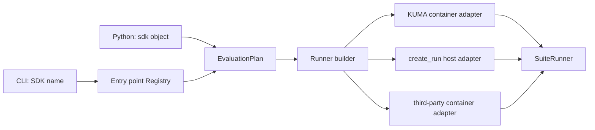

# Evaluation SDK 插件架构

## 结论

ABB 使用一个 benchmark orchestration module、两个 composition root：

- Python API 接受调用方已经持有的 SDK object。
- CLI 接受可保存、可复现的字符串引用，并通过 Python package entry point
  找到已安装的 SDK plugin。

两条入口都会生成同一种 immutable `EvaluationPlan`，再由同一个 runner
builder 选择 execution Strategy。PyPI 是 SDK 的安装和版本分发渠道；CLI 是
安装完成后的选择界面。entry point 解决发现问题，本身不负责把依赖运输进容器。



## Design patterns

| Pattern | ABB 中的实现 | 作用 |
| --- | --- | --- |
| Ports and Adapters | `SuiteRunner` 依赖 `EvaluationRunner` interface | benchmark orchestration 不需要识别 KUMA 或其它 SDK |
| Strategy | `EvaluationSDKPlugin.execution` 和 `create_benchmark_runner()` | 在 composition root 选择正式容器或本地执行策略 |
| Abstract Factory | plugin 为一次 CLI/Python 配置创建 runner | 隔离 SDK 配置、凭证和运行状态 |
| Anti-corruption Adapter | `KumaEvaluationSDK` | KUMA 的来源目录、密钥、worker 和 artifact 约束留在一个 adapter 后面 |
| Registry | `defuzex_agentbench.evaluation_sdks` entry point group | CLI 能按稳定名称发现 PyPI 包，而不硬编码 import path |
| Value Object | `SDKReference`、`SDKSelection`、`EvaluationPlan` | 保留分发包、版本、object ref 和选项，便于诊断和复现 |
| State | `SDKRun.get_input()` / `submit()` handshake | 一个 Input 保持 pending，提交后才能前进；每个 Case 使用新 Run |

这里的高 leverage seam 是 `EvaluationSDKPlugin`。一个正式 plugin 隐藏复杂的
image、worker、网络与凭证策略，向 ABB 暴露一个小 interface，因此 module 有
足够的 depth。修改 KUMA 应集中在 KUMA adapter；添加 SDK 应集中在新的分发包，
而不是修改 CLI、`SuiteRunner` 或 Agent adapter。这也提高了 locality。

## Python 与 CLI

Python 调用方已经能持有 object，因此最短路径仍然是直接注入：

```python
import my_evaluation_sdk
from agentbench.harness import SuiteRunner

runner = SuiteRunner(
    sdk=my_evaluation_sdk,
    sdk_options={"difficulty": "bounded"},
)
```

这种 object 只存在于当前解释器，ABB 将它标为 `local`。它适合单元测试、离线
SDK 和开发调试。ABB 不会假定任意 object 或 closure 能被序列化并部署进 Docker。

CLI 不能接收 object，所以使用分发包声明的 entry point：

```toml
[project]
name = "acme-evaluation-sdk"
version = "2.1.0"
dependencies = ["defuzex-agentbench>=0.1,<0.2"]

[project.entry-points."defuzex_agentbench.evaluation_sdks"]
acme = "acme_evaluation:plugin"
```

安装后可用稳定名称选择：

```bash
python -m pip install acme-evaluation-sdk==2.1.0
agentbench sdk list
agentbench sdk show acme
agentbench run --sdk acme --sdk-options evaluation.json
```

`sdk list` 只读取 package metadata，不加载第三方代码。`run` 和 `show` 只加载被
选中的 entry point。如果不同 distribution 声明相同名称，短名称会报歧义，调用方
必须使用 `DISTRIBUTION::NAME`。`kuma` 是保留的内置名称；同名外部 plugin 也必须
使用 distribution 限定：

```bash
agentbench run --sdk acme-evaluation-sdk::acme
```

开发期仍可显式 import：

```bash
agentbench run --sdk python:examples.local_sdk
agentbench run --sdk python:my_package:configured_sdk
```

旧的 `MODULE[:OBJECT]` 形式暂时兼容，但新脚本应加 `python:`，让 execution
locality 一眼可见。`--sdk kuma` 与省略 `--sdk` 都选择内置正式 KUMA adapter。

PyPA 的 entry point 规范定义了 group、name 和 object reference，Python 的
`importlib.metadata.entry_points()` 提供已安装分发包的发现接口：

- [PyPA Entry points specification](https://packaging.python.org/en/latest/specifications/entry-points/)
- [PyPA Creating and discovering plugins](https://packaging.python.org/en/latest/guides/creating-and-discovering-plugins/)
- [Python `importlib.metadata`](https://docs.python.org/3/library/importlib.metadata.html)

pytest 使用 `pytest11` entry point 发现外部 plugin，是这个模式的成熟先例：
[Writing plugins for pytest](https://docs.pytest.org/en/latest/how-to/writing_plugins.html)。

## Plugin interface

简单 SDK 只需提供现有 behaviour interface：

```python
class SDK(Protocol):
    def create_run(self, **options: object) -> SDKRun: ...
```

这种 interface 由 ABB 的 host adapter 执行。需要正式容器语义的 PyPI plugin
实现以下 interface：

```python
class EvaluationSDKPlugin(Protocol):
    name: str
    api_version: str       # "agentbench.evaluation_sdk.v1"
    execution: Literal["container", "local"]

    def create_benchmark_runner(
        self,
        *,
        context: SDKRunnerContext,
        options: Mapping[str, object],
    ) -> EvaluationRunner: ...
```

`create_benchmark_runner()` 是迁移 seam：它允许 KUMA 和第三方正式 evaluator
在不改 benchmark suite 的情况下替换。返回值必须实现 `validate_sdk()` 和
`run()`；ABB 会在启动 Agent 前验证 plugin API version、execution mode 和 runner
shape。Plugin 安装或依赖解析不会在 benchmark run 中自动发生。

## 正式容器的下一层 interface

当前纵向切片已经消除了 CLI 对 KUMA 的硬编码选择，并把 KUMA 的 image、service、
worker 与 artifact interpretation 移入 `agentbench.sdk.kuma_runtime`。原来的
`agentbench.evaluation.*` 路径只保留兼容 import；通用 evaluation module 只留下
artifact 存储、input binding 和 handshake runner。要让多个容器 evaluator 共享
镜像构建与 artifact 验证，下一层应把 runner factory 收窄成下面四个 port：

```python
class EvaluatorFactory(Protocol):
    def preflight(self, context: EvaluationContext) -> Capabilities: ...
    def open_case(self, context: EvaluationContext) -> CaseSession: ...

class CaseSession(Protocol):
    def next_input(self) -> InputEnvelope | None: ...
    def submit(self, submission: CandidateSubmission) -> SubmissionReceipt: ...
    def finish(self) -> VerdictEnvelope: ...
    def abort(self, failure: FailureRecord) -> None: ...

class CandidateFactory(Protocol):
    def prepare(self, descriptor: CandidateDescriptor) -> CandidateSession: ...

class ExecutionBackend(Protocol):
    def materialize(self, plan: EvaluationPlan) -> PreparedExecution: ...
```

Kernel 固定 behaviour 顺序：

```text
resolve → preflight → materialize → open Case → next Input
→ invoke candidate → seal evidence → submit → finish Judge → validate artifacts
```

不变量：

- 每个 Case 创建独立 session。
- 同时最多一个 pending Input。
- 一个 `input_id` 只能成功提交一次；网络重试复用同一个 submission id。
- Evidence seal 后才允许提交。
- host 生成 artifact 路径；plugin ID 不直接用作路径。
- run、case、input、submission、agent identity 在所有 artifact 中一致。
- secret 只以名称出现在 plan 中，值不写入 plan 或 artifact。
- 正式容器不能静默降级为 host-local。
- plugin distribution、version、wheel digest 与 interface version 写入 run manifest。

理想的正式镜像在同一个 OCI sandbox 中使用独立进程和 venv：

```text
/opt/abb/core-venv       orchestration 和 artifact validation
/opt/abb/evaluator-venv  KUMA 或其它 evaluator
/opt/abb/candidate-venv  Agent 与 framework adapter
/run/abb/*.sock          versioned JSON transport
/run/abb-output          append-only artifacts
```

entry point 只提供 package identity。正式 runner 应在准备阶段把 evaluator wheel、
依赖 wheelhouse、准确版本和 hash 固化进 build context，运行时不联网执行 `pip
install`。这样才同时获得 CLI 热插拔、依赖隔离与可复现性。

OTel provider 也应由 ABB application 初始化，plugin 只接收 sealed evidence。
OpenTelemetry 的 Python 指南把 SDK/provider 初始化归于 application，把 library
限定在 API 使用，这与该 module 归属一致：
[OpenTelemetry Python instrumentation](https://opentelemetry.io/docs/languages/python/instrumentation/)。

## 迁移状态

已经落地：

- `EvaluationRunner` port；
- immutable `SDKReference`、`SDKSelection`、`EvaluationPlan`；
- PyPA entry point 发现、名字冲突检测、distribution 限定选择；
- `sdk list` 与 `sdk show`；
- KUMA 作为显式 container Strategy；
- KUMA 的 image、service、worker 和 result adapter 已集中到 `sdk/kuma_runtime`；
- Python object 和旧 import string 的兼容 adapter；
- 缺失的离线 `examples.local_sdk` 示例。

后续收窄：

1. 用 `CaseSession` adapter 隐藏 `run._case` 等版本敏感字段。
2. 把 OTel、artifact validation 和 network policy 提升到 Kernel module。
3. 固化 wheelhouse 与 digest，并写入 run manifest。
4. evaluator 与 candidate 改成同容器不同进程，避免 Python dependency 冲突。
