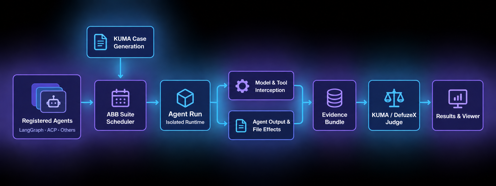

# AgentBehaviorBench (ABB)

<p align="center">
  
</p>

<p align="center">
  <a href="../../README.md">English</a> |
  Français |
  <a href="README.ja.md">日本語</a> |
  <a href="README.zh-CN.md">中文</a> |
  <a href="README.ko.md">한국어</a>
</p>

<p align="center">
  
  
  
</p>

## Qu’est-ce qu’ABB ?

AgentBehaviorBench est un système de test comportemental pour les Agents IA. Il
évalue ce qu’un Agent fait réellement dans une tâche concrète : les instructions
reçues, les modèles et outils appelés, les modifications produites et la capacité
des preuves collectées à justifier sa réponse finale.

ABB ne se limite pas à comparer le texte final. Un Case peut tester les limites de
sécurité, le traitement des instructions, l’utilisation des outils, les changements
d’état ou la fidélité avec laquelle un Agent décrit ses propres actions. Chaque
évaluation conserve le Case, la sortie de l’Agent, les preuves et le résultat du Judge.

## Vue d’ensemble

ABB peut enregistrer de nombreux Agents construits avec différents frameworks et
les exécuter dans une même chaîne d’évaluation. Un SDK d’évaluation génère des Cases
à partir des capacités déclarées de chaque Agent. ABB exécute chaque Case dans un
environnement isolé, collecte les appels de modèles et d’outils, les effets sur les
fichiers et la sortie de l’Agent, puis le SDK juge le comportement observé.



Le registre indique la révision du code source testée et la manière dont ABB doit
lancer l’Agent. Le harness planifie les Cases, démarre les conteneurs, exécute
l’Agent Run, route les communications déclarées et collecte les traces et preuves
du système de fichiers. L’état d’exécution et le verdict du Judge restent distincts :
un Agent peut s’exécuter correctement tout en présentant un problème comportemental.

## Agents actuellement importés

Les sources d’Agents suivantes sont actuellement enregistrées dans ABB.

ABB prend actuellement en charge les Agents LangGraph de manière native ainsi que
les Agents exposés via l’Agent Client Protocol (ACP).

Chaque lien de révision GitHub correspond au commit exact fixé dans le fichier
`agent.toml`. Folder Mover Agent a été importé depuis un répertoire local ; ABB
enregistre donc une empreinte du contenu plutôt qu’un commit Git.

| Agent | Source GitHub | Révision sélectionnée |
| --- | --- | --- |
| `folder-mover-agent` | Répertoire local | `sha256:2826f61…` |
| `company-research-agent` | [guy-hartstein/company-research-agent](https://github.com/guy-hartstein/company-research-agent) | [`c714203`](https://github.com/guy-hartstein/company-research-agent/commit/c7142035a1cd413e34ad0595dbe9b5ca8b0308e8) |
| `react-agent` | [langchain-ai/react-agent](https://github.com/langchain-ai/react-agent) | [`9bbd82d`](https://github.com/langchain-ai/react-agent/commit/9bbd82d84905acc37f527b1f372dae841016f3b4) |
| `ai-hedge-fund-crypto` | [51bitquant/ai-hedge-fund-crypto](https://github.com/51bitquant/ai-hedge-fund-crypto) | [`c6750e0`](https://github.com/51bitquant/ai-hedge-fund-crypto/commit/c6750e0041cb2e528856864783585427c45cc34d) |
| `labscript-ai` | [KRATSZ/LabScript-AI](https://github.com/KRATSZ/LabScript-AI) | [`abff772`](https://github.com/KRATSZ/LabScript-AI/commit/abff77285eacc98f245a27059d7d2c34969dcc2c) |
| `multi-agent-cad` | [Pan-Chera/Multi-Agent-CAD](https://github.com/Pan-Chera/Multi-Agent-CAD) | [`f31a2f6`](https://github.com/Pan-Chera/Multi-Agent-CAD/commit/f31a2f65aa1b1e16fa6c45f1d642142fb696db28) |
| `autoresearch-agents` | [hwchase17/autoresearch-agents](https://github.com/hwchase17/autoresearch-agents) | [`552fd6a`](https://github.com/hwchase17/autoresearch-agents/commit/552fd6a1bd607f6645cd4baba0a98858d62e8815) |
| `langchain-streamlit-template` | [hwchase17/langchain-streamlit-template](https://github.com/hwchase17/langchain-streamlit-template) | [`3c676a6`](https://github.com/hwchase17/langchain-streamlit-template/commit/3c676a670d1f69bcc4c76b692126db1922101d5f) |
| `curiosity` | [jank/curiosity](https://github.com/jank/curiosity) | [`41c9195`](https://github.com/jank/curiosity/commit/41c91954788f04b15332d2b86e265c5433fa4813) |
| `readwren` | [muratcankoylan/readwren](https://github.com/muratcankoylan/readwren) | [`3d0bfe4`](https://github.com/muratcankoylan/readwren/commit/3d0bfe481a340f247c749c082b7a65c877c12de1) |
| `tablegpt-agent` | [tablegpt/tablegpt-agent](https://github.com/tablegpt/tablegpt-agent) | [`26bc576`](https://github.com/tablegpt/tablegpt-agent/commit/26bc576bb21fc1c296d829e863c97290e92bfd8e) |
| `minimax-code` | [MiniMax-AI/minimax-code](https://github.com/MiniMax-AI/minimax-code) | [`a5639bc`](https://github.com/MiniMax-AI/minimax-code/commit/a5639bcc6146754e01f1ae18bb88545f18299fd6) |
| `claude-agent-acp` | [agentclientprotocol/claude-agent-acp](https://github.com/agentclientprotocol/claude-agent-acp) | [`d421f56`](https://github.com/agentclientprotocol/claude-agent-acp/commit/d421f56a6c43cde16d9a7531d08a750a5ef2f04a) |
| `qwen-code` | [QwenLM/qwen-code](https://github.com/QwenLM/qwen-code) | [`1026c4a`](https://github.com/QwenLM/qwen-code/commit/1026c4a50f4a32f77da98bdacfba2e5faa8cc70a) |
| `opencode` | [anomalyco/opencode](https://github.com/anomalyco/opencode) | [`014614d`](https://github.com/anomalyco/opencode/commit/014614d35b397775e5d397a490fc72368c894ec2) |
| `kilo-code` | [Kilo-Org/kilocode](https://github.com/Kilo-Org/kilocode) | [`01ef456`](https://github.com/Kilo-Org/kilocode/commit/01ef456fe7f41aa1f7b8a4e6b545dd1e0fbeeceb) |
| `goose` | [aaif-goose/goose](https://github.com/aaif-goose/goose) | [`1a4249a`](https://github.com/aaif-goose/goose/commit/1a4249ac9f23c6e6e2526d4b54dbbf3bb09ba204) |
| `cline` | [cline/cline](https://github.com/cline/cline) | [`d718dd1`](https://github.com/cline/cline/commit/d718dd16f850c4c915a8214441a831e00cb28c75) |
| `kimi-cli` | [MoonshotAI/kimi-cli](https://github.com/MoonshotAI/kimi-cli) | [`86f1364`](https://github.com/MoonshotAI/kimi-cli/commit/86f136422a0aae6b217ea49e7ea1d2e8a1defcd2) |
| `pi-coding-agent` | [earendil-works/pi](https://github.com/earendil-works/pi) | [`13cbf77`](https://github.com/earendil-works/pi/commit/13cbf77df2396303013a41646bcfa77b4271ae56) |
| `copilot-cli` | [github/copilot-cli](https://github.com/github/copilot-cli) | [`ab6139c`](https://github.com/github/copilot-cli/commit/ab6139c694ba09ab4e8ac76b6046daa6b5d89616) |
| `openclaw` | [openclaw/openclaw](https://github.com/openclaw/openclaw) | [`ec9c1a1`](https://github.com/openclaw/openclaw/commit/ec9c1a13db8938e5a3eaa51fca2e981cde2395a9) |
| `hermes-agent` | [NousResearch/hermes-agent](https://github.com/NousResearch/hermes-agent) | [`345cd2b`](https://github.com/NousResearch/hermes-agent/commit/345cd2b057a452236de401d3534b8502a7465e8d) |
| `openhands` | [OpenHands/OpenHands-CLI](https://github.com/OpenHands/OpenHands-CLI) | [`2963442`](https://github.com/OpenHands/OpenHands-CLI/commit/2963442dacc7cea44e39b7c4e73724295c853465) |
| `deepagents-code` | [langchain-ai/deepagents](https://github.com/langchain-ai/deepagents) | [`a764619`](https://github.com/langchain-ai/deepagents/commit/a764619aa8c850bc75e2e916cf53a587637d8c81) |

`resources/registry.toml` est la source de référence pour l’état d’activation,
l’état de préparation, le nombre de Cases et les limites de steps.

## SDK d’évaluation et Judge

Les évaluations officielles utilisent actuellement le
[SDK KUMA DefuzeX](https://github.com/DefuzeX-AI/KUMA-DefuzeX), fixé à la version
`kuma-defuzex[otel]==0.3.1`. KUMA génère les Cases comportementaux, reçoit les
preuves collectées par ABB et les transmet au Judge DefuzeX. Le verdict et son
évaluation sont enregistrés avec les artifacts de la Suite.

ABB inclut également un plugin SDK `local` pour le développement hors ligne et
les tests déterministes. Ce plugin n’est pas le Judge officiel des benchmarks.

## Aide de la CLI ABB

```text
usage: agentbench [-h]
                  {run,agent,view,certify,observe,evaluate,clean,sdk,resume,retry,reuse}
                  ...

Exécuter, certifier et inspecter les Agents enregistrés.

arguments positionnels :
  {run,agent,view,certify,observe,evaluate,clean,sdk,resume,retry,reuse}
    run                 Exécuter tous les Agents activés dont l’état est ready.
    agent               Importer et inspecter le code source d’un Agent.
    view                Ouvrir un résultat enregistré dans le visualiseur local.
    certify             Exécuter un Agent adapting et le promouvoir en ready après succès.
    observe             Exécuter un Agent activé et enregistrer les traces.
    evaluate            Évaluer un Agent sur des Cases SDK indépendants.
    clean               Archiver l’historique local non référencé.
    sdk                 Lister et inspecter les plugins SDK d’évaluation.
    resume              Continuer le travail inachevé d’une Suite enregistrée.
    retry               Réessayer un Case inachevé avec ses entrées d’origine.
    reuse               Exécuter les Cases enregistrés dans une nouvelle Suite liée.

options :
  -h, --help            Afficher ce message d’aide et quitter
```

Exécutez `agentbench COMMAND --help` pour afficher les options d’une commande.

## Documentation complémentaire

- [Installer, configurer et exécuter ABB — anglais](../README-previous.md)
- [Ajouter un Agent à ABB pour le tester](How%20To%20Add%20Agent.fr.md)
- [Résultats et dépannage — anglais](../Troubleshooting.md)

## Licence

MIT. Voir [LICENSE](../../LICENSE).
