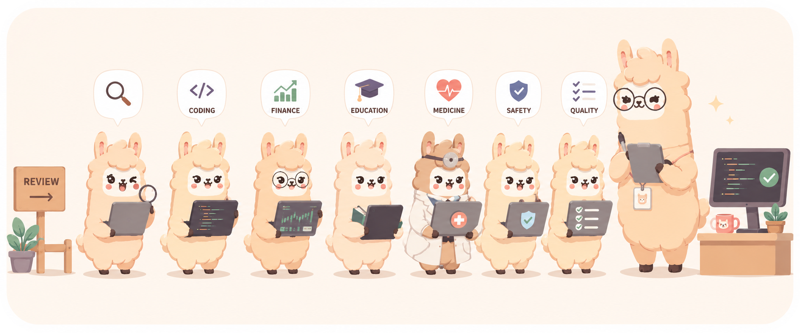
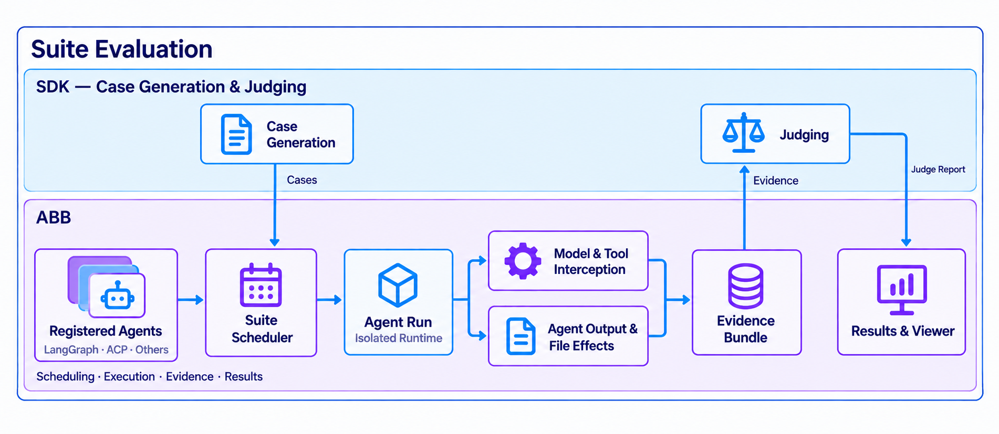

# AgentBehaviorBench (ABB)

  

  <a href="../../README.md">English</a> |
  <a href="README.fr.md">Français</a> |
  日本語 |
  <a href="README.zh-CN.md">中文</a> |
  <a href="README.ko.md">한국어</a>

  
  
  

## ABB とは？

AgentBehaviorBench（ABB）は、AI Agent がほかの Agent の振る舞いをテストする能力を
評価するベンチマークです。直接起動できる対象 Agents と、人手による実際のテストで確認された
振る舞い上の欠陥という 2 種類のデータを含みます。確認済みの欠陥を Ground Truth
（正解データ）として使用します。評価に参加するテスト Agent はテストケースを生成し、
対象 Agent に実行させ、その実行軌跡を分析して対象 Agent の問題を発見します。

## 概要

ABB は Adapters を通じて異なるフレームワークの対象 Agents を統合し、共通の
パイプラインでテストケースを実行して振る舞いの証拠を収集します。ABB に接続するテスト
Agent には、テストケースの生成、実行証拠の分析、欠陥の判定（Judge）を行う能力が必要で、
評価 SDK を通じて接続します。実行証拠には、テスト入力、Agent の出力と実行状態、
OpenTelemetry トレース、およびファイル証拠の収集が有効な場合のファイル変更記録と
Diff が含まれます。テスト Agent はこれらの証拠に基づいて振る舞い上の欠陥を報告します。
ベンチマークでは、Ground Truth に指定された欠陥を特定すると、対応する得点が与えられます。

AgentBehaviorBench の評価に参加する各テスト Agent は、以下の能力を備える必要があります。

1. **テストケース生成（Case Generation）**：対象 Agent の機能と振る舞いの制約に基づき、その振る舞いを検証するテストケースを生成する。
2. **実行軌跡分析（Trajectory Analysis）**：テスト入力、Agent の出力、OpenTelemetry トレース、ファイル変更の証拠を分析し、振る舞い上の異常の可能性を特定する。
3. **欠陥判定（Judging）**：実行証拠に基づいて対象 Agent に振る舞い上の欠陥があるかを判断し、具体的な問題とその根拠となる証拠を報告する。

Agent Registry は、テスト対象のソースリビジョンと ABB が Agent を起動する方法を記録します。
Harness は Cases をスケジュールし、コンテナを起動し、Agent Run を実行し、宣言された通信を
ルーティングして trace とファイルシステム証拠を収集します。実行状態と Judge の判定は別です。
Agent が正常に実行されても、Judge が振る舞い上の問題を検出する場合があります。

## リソース

- [登録済み Agents](Agents.ja.md) — 対象 Agent の一覧、ソースリポジトリ、固定リビジョン。
- [Agent 登録表の読み方](Registry.ja.md) — `registry.toml` のフィールド、Agent の選択、Case の予算。
- [Agent を追加する方法](How%20To%20Add%20Agent.ja.md)
- [CLI リファレンス](cli.ja.md)
- [ABB の起動方法 — 英語](../Guide.md)

## 評価 SDK と Judge

正式な評価では現在 [KUMA DefuzeX SDK](https://github.com/DefuzeX-AI/KUMA-DefuzeX)
を `kuma-defuzex[otel]` としてインストールします。SDK のインストール処理が実行されると、
PyPI の最新安定版が選択されます。既存のイメージと Docker のビルドレイヤーは再利用され、
SDK の新バージョン公開だけでは自動更新されません。KUMA は振る舞いテストの Cases を
生成し、ABB が収集した証拠を受け取り、DefuzeX Judge に送信します。判定結果と評価内容は
Suite artifacts とともに保存されます。

ABB には固定スモークテスト Cases とローカル Judge を使う `local` SDK plugin も含まれます。
KUMA 後端のクレジットは不要ですが、Agent と Judge のモデル呼び出しには料金が発生する場合があります。
これは正式な benchmark 結果に使用される Judge ではありません。

## 関連ドキュメント

- [ABB のインストール、設定、実行 — 英語](../README-previous.md)
- [結果とトラブルシューティング — 英語](../Troubleshooting.md)

## ライセンス

MIT。詳細は [LICENSE](../../LICENSE) を参照してください。
