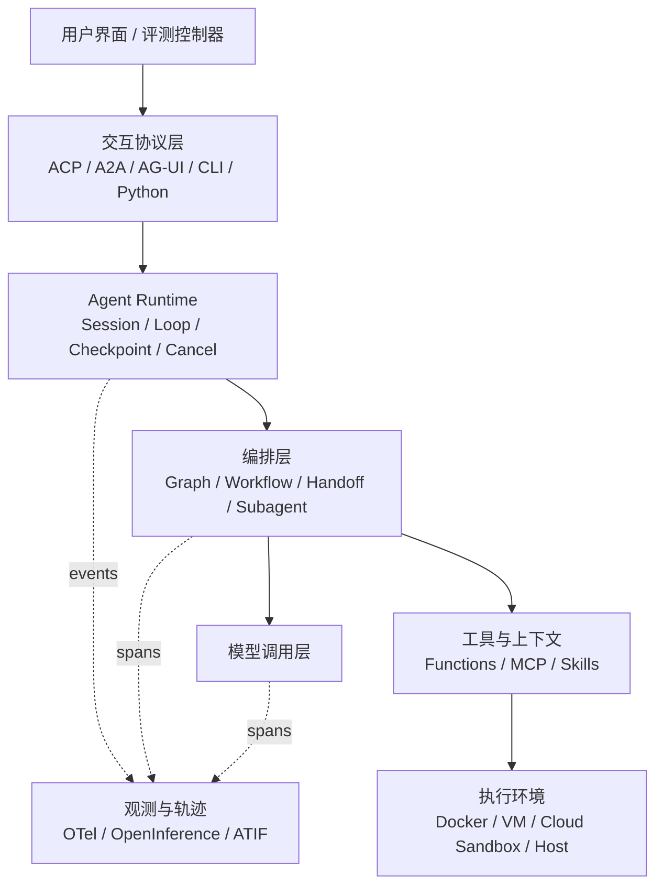

# Agent 架构与协议调研（2026-09）

调研日期：2026-09-15

本文研究评测系统如何接入不同形态的 Agent，重点分析 Harbor 的 external/installed Agent，并比较 ACP、MCP、A2A、AG-UI、OpenTelemetry/OpenInference 和 ATIF 所处的层级。最后给出 AgentBehaviorBench（BBA）的建议架构。

## 结论

Agent 已经不再只是一个 `graph.invoke()` 或 Python 函数。一个可以被第三方运行和评测的 Agent，至少包含以下独立维度：

1. **实现**：LangGraph、OpenAI Agents SDK、ADK、AutoGen、自研循环等。
2. **交付物**：Git 仓库、Python/Node 包、二进制、容器镜像或远程服务。
3. **运行位置**：评测进程、隔离环境、独立本地进程或远程服务。
4. **通信协议**：Python 调用、CLI、ACP、HTTP API、A2A 等。
5. **会话生命周期**：单次调用、长期 Session、后台任务或可恢复任务。
6. **输入输出语义**：聊天消息、结构化领域输入、文件、Artifact。
7. **能力**：多轮、取消、恢复、文件操作、工具、MCP、结构化输出等。
8. **安全策略**：文件系统、网络、身份、密钥和用户授权。
9. **观测与轨迹**：协议事件、原生日志、OTel Trace、OpenInference、ATIF。

BBA 不应使用一个 `framework` 或 `adapter.type` 同时表达以上所有维度。BBA 应建立自己的稳定内部 Session/Event 合约，再把 LangGraph、CLI、ACP、A2A 等作为边界适配器。

## 一、Agent 的通用分层



近期主流框架也在向这个分层靠拢：

- [LangGraph](https://docs.langchain.com/oss/python/langgraph/overview) 把自己定位为持久化、流式执行、人工介入和故障恢复的 orchestration runtime。
- [OpenAI Agents SDK](https://openai.github.io/openai-agents-python/) 把 Agent、工具、handoff、guardrail、session、human-in-the-loop 和 tracing 组合为运行时。
- [Microsoft Agent Framework](https://learn.microsoft.com/en-us/agent-framework/concepts/) 明确区分 Agent、Workflow 与更完整的 Harness Agent。
- [Inspect AI](https://inspect.aisi.org.uk/agents.html) 使用小型 `Agent(AgentState) -> AgentState` 合约，并通过 Bridge 接入第三方 Python 或 sandbox Agent。

共同方向是：Agent 的业务实现、运行时、协议、工具、安全与观测逐渐分离。

## 二、Harbor 的 external 与 installed 到底指什么

[Harbor 官方文档](https://github.com/harbor-framework/harbor/blob/main/docs/content/docs/agents/index.mdx) 的分类标准是 **Agent 主循环运行在哪里**。

| Harbor 类型 | Agent 主循环位置 | 如何操作任务环境 | 典型用途 |
| --- | --- | --- | --- |
| External Agent | Harbor/宿主控制进程 | 调用 `BaseEnvironment.exec()` 等接口 | 自研循环、训练/RL、需要逐步控制模型调用 |
| Installed Agent | 任务容器或 sandbox 内 | Agent 自己使用容器内 CLI、文件和工具 | Claude Code、Codex CLI、OpenHands 等完整 Agent |

### External Agent

External Agent 继承 `BaseAgent`。它的 LLM 循环留在 Harbor 进程里，任务容器只提供受控环境能力。

```text
Harbor process
  └─ Agent loop / model / policy
       └─ BaseEnvironment.exec(...)
            └─ task sandbox
```

优势：

- Harbor 能看到并控制每一步。
- 适合收集 token、logprob 和逐步 reward。
- 适合 RL，因为训练器可以拥有策略循环。
- Agent 即使运行在宿主，也只能通过 `BaseEnvironment` 操作 sandbox。

代价：

- 需要把 Agent 循环改造成 Harbor 的接口。
- Agent 自带的终端、插件、权限系统和原生 Session 可能难以保留。
- 宿主依赖容易冲突，需要严格管理进程内依赖。

Hugging Face TRL 对 Harbor 的集成采用这一形态，因为训练器必须逐步控制 rollout 并收集 logprob。[TRL 对 external/installed 的说明](https://github.com/huggingface/trl/blob/main/docs/source/harbor.md)

### Installed Agent

Installed Agent 继承 `BaseInstalledAgent`。Harbor 在任务环境中安装 Agent，然后以 headless CLI 运行。

```text
Harbor process
  └─ task sandbox
       ├─ install agent
       ├─ launch headless command
       └─ collect logs / trajectory / output
```

优势：

- 保留 Agent 的原生工具链与运行行为。
- Agent 与被操作的 workspace 位于同一隔离环境。
- 适合大量不同语言、不同 CLI 的第三方 Agent。
- Agent 的依赖不会污染 Harbor 控制进程。

代价：

- 安装慢，需要版本和依赖锁定。
- 不同 CLI 的启动参数、输出、失败语义和日志格式不同。
- 如果只能在结束后解析日志，实时可观测性与故障恢复较弱。
- 密钥、网络、文件权限需要由 sandbox 策略明确控制。

Harbor 推荐多数普通集成优先使用 Installed Agent；只有 Agent loop 必须留在任务环境之外时才使用 External Agent。[Harbor Custom Agents](https://www.harborframework.com/docs/core-concepts/agents/custom-agents)

### ACP 在 Harbor 中的位置

Harbor 的通用 ACP Runner 本身是一个 `BaseInstalledAgent`：

```text
Installed Agent（运行位置）
  └─ ACP（通信协议）
       └─ registry distribution / source manifest（交付方式）
```

因此，`external/installed` 与 `ACP/Python/CLI` 是两个不同维度。

Harbor 支持从 [ACP Registry](https://github.com/agentclientprotocol/registry) 解析 Agent，并按 binary、npx、uvx 或 local distribution 安装。运行时保存 `acp-events.jsonl`、summary、文本输出，并转换为 ATIF。[Harbor ACP 文档](https://www.harborframework.com/docs/core-concepts/agents/acp)

Hosted Harbor 进一步要求第三方自定义 Agent：

- 存放在 GitHub；
- 提供固定格式的 `harbor-agent.json`；
- 使用锁定的 Python 项目和 `uv.lock`；
- entrypoint 必须通过 stdin/stdout 讲 ACP；
- 服务端解析并记录确定的 commit SHA。

这反映出 Hosted 平台不适合导入任意用户 Python 类。源码、运行时、版本、入口和协议都必须可验证。[Hosted Harbor Custom Agents](https://www.harborframework.com/docs/hosted-harbor/custom-agents)

### Harbor 值得 BBA 学习的点

1. 分类基于执行责任，而不是 Agent 使用的开发框架。
2. Agent、Task、Trial、Environment、Verifier 分开建模。
3. 安装与运行是两个阶段。
4. 自定义参数有 Schema，未知参数在创建环境前失败。
5. Agent 显式声明 `resume`、`ATIF`、`MCP`、Windows 等能力。
6. Git ref、包版本和协议 SDK需要锁定。
7. Native trajectory 与可移植 trajectory 分开保存。

Harbor 曾因 ACP SDK 未锁定而在上游删除 `session/set_model` 后导致所有带 model 的新容器运行失败，这正说明协议依赖必须 pin 并做兼容测试。[Harbor ACP 兼容问题](https://github.com/harbor-framework/harbor/issues/2206)

## 三、协议分别解决哪一层

| 协议/格式 | 两端是谁 | 主要对象 | 最适合解决 | 不能替代 |
| --- | --- | --- | --- | --- |
| ACP | Client ↔ Agent process | Session、Prompt、Update、Tool Call、Permission | 本地/容器内完整 Agent 的启动和交互 | sandbox、Judge、工具实现、Trace 标准 |
| MCP | Agent Host ↔ Tool/Context Server | Tools、Resources、Prompts | 给 Agent 提供工具和上下文 | 完整 Agent 生命周期、Agent 评测 |
| A2A | Agent/Client ↔ 独立 Agent Service | AgentCard、Task、Message、Artifact | 跨机器、跨组织的远程 Agent 协作 | 本地进程安装、workspace sandbox |
| AG-UI | Agent Backend ↔ User-facing App | Run、Message、State、Tool、UI Event | 前端实时展示、状态同步、人工介入 | Agent 安装和隔离 |
| OTel/OpenInference | Instrumented runtime ↔ Collector | Trace、Span、Event、Metric | 跨框架观测、性能和错误关联 | 可恢复业务轨迹、调用协议 |
| ATIF | Agent/Adapter → Artifact consumer | Steps、Messages、Tool Calls、Observations、Metrics | 离线回放、Viewer、SFT/RL、跨 Agent 轨迹 | 在线控制、协议协商 |

### ACP：Client 控制完整 Agent

[ACP](https://github.com/agentclientprotocol/agent-client-protocol) 使用 JSON-RPC。典型生命周期包括：

```text
initialize
session/new
session/prompt
session/update ...
session/cancel
session/resume
session/close
```

ACP 的 Session 带 cwd，并能把 MCP Server 配置传给 Agent。它适合 IDE、桌面客户端或 benchmark harness 启动一个会操作 workspace 的 Agent。[ACP Session 说明](https://github.com/agentclientprotocol/agent-client-protocol/blob/main/docs/protocol/v2/session-setup.mdx)

截至调研日，ACP v1 是稳定接口，v2 仍以 experimental/unstable 方式演进。[ACP v2 状态](https://github.com/agentclientprotocol/rust-sdk/blob/main/md/protocol-v2.md)

### MCP：Agent 使用工具和数据

[MCP 架构](https://modelcontextprotocol.io/specification/2025-06-18/architecture) 是 Host–Client–Server：Host 管理模型、权限与上下文；每个 MCP Client 与一个 MCP Server 建立 Session；Server 暴露 tools、resources、prompts。

MCP Server 通常不是待评测 Agent。BBA 应把 MCP 视为 Agent 的依赖或能力，由 Runtime/Session 注入。

### A2A：调用远程、独立、可能不透明的 Agent

[A2A](https://github.com/a2aproject/A2A) 面向独立 Agent 服务。AgentCard 描述身份、endpoint、skills、输入输出模式、安全和流式能力；Task 有状态机，并产生 Artifact。当前正式规范为 1.0.0。[A2A 规范](https://github.com/a2aproject/A2A/blob/main/docs/specification.md)

A2A 比 ACP 更适合：

- Agent 已经部署为远程服务；
- 长任务需要 polling、SSE 或 push notification；
- 输出是报告、文件、结构化数据等 Artifact；
- Agent 内部实现和 workspace 对调用方不透明。

### AG-UI：把 Agent 运行状态送到网页

[AG-UI](https://github.com/ag-ui-protocol/ag-ui) 定义 run、step、text message、tool call、state snapshot/delta、activity、error 等事件。它适合 BBA Viewer 的实时展示和 Redux 状态更新。

AG-UI 可以作为 BBA 内部事件模型的参考，但没有必要要求每个被测 Agent 原生支持 AG-UI。BBA 可以把 ACP、A2A、CLI 和 Python Adapter 的事件统一投影成自己的事件，再由 Viewer 消费。

### OTel/OpenInference 与 ATIF

[OpenTelemetry GenAI Agent conventions](https://github.com/open-telemetry/semantic-conventions-genai/blob/main/docs/gen-ai/gen-ai-agent-spans.md) 已经定义或讨论 `invoke_agent`、workflow、plan、execute_tool 等 span，但 Agent 部分目前仍标记为 Development。

[OpenInference](https://arize-ai.github.io/openinference/spec/) 在 OTel 上补充 LLM、AGENT、TOOL、RETRIEVER、EVALUATOR 等语义，适合 BBA 接收不同框架的 trace。

[ATIF](https://github.com/harbor-framework/harbor/blob/main/rfcs/0001-trajectory-format.md) 是离线 JSON 轨迹格式，目标是统一消息、推理、工具、观察、指标和 RL 数据。它更接近 BBA 报告需要的“可保存证据”。

BBA 可以同时保留：

- 原始协议事件，用于审计；
- OTel/OpenInference，用于分布式时序与跨服务关联；
- BBA 自己的标准结果与错误分类；
- ATIF 或兼容的标准轨迹，用于 Viewer、导出和训练。

## 四、主流评测系统的接入模式

| 系统 | Agent 接入边界 | 隔离 | 特点 | BBA 可借鉴 |
| --- | --- | --- | --- | --- |
| Harbor | `BaseAgent` / `BaseInstalledAgent` / ACP | Docker 与多种云 sandbox | 任务环境、Agent、Verifier 强分离 | 运行位置分类、安装阶段、能力声明、ATIF |
| Inspect AI | `AgentState -> AgentState`、Python/Sandbox Bridge | 内建 sandbox | 原生 Agent、第三方框架、checkpoint、intervention、limits | 小型内部 Agent 合约和 Bridge |
| SWE-bench | Agent 先产出 prediction patch；harness 后评测 | Docker | 生成与评分完全解耦 | 支持导入已有结果，评测无需重新运行 Agent |
| LangSmith | target function：input dict → output dict | 由用户应用负责 | 数据集、并发、缓存、trace、judge | 简单 black-box target 合约与逐 Case 结果流 |

[Inspect Agent Bridge](https://inspect.aisi.org.uk/agent-bridge.html) 同时支持同进程 Python Agent 与 sandbox 内任意语言 Agent，这是比单纯按“framework”分类更成熟的方式。

[SWE-bench](https://github.com/SWE-bench/SWE-bench/blob/main/docs/guides/quickstart.md) 让 Agent 生成 patch prediction，评测 harness 只消费结果文件并在 Docker 中验证。这个模式非常适合 BBA 的“结果复用”：Agent 执行、Case、Judge 都应保存独立 Artifact，已有有效输出不必重跑。

[LangSmith](https://docs.langchain.com/langsmith/evaluate-llm-application) 将被测系统收敛成输入字典到输出字典的 target function，同时按 Case 保存输出、evaluator 与 trace。它说明 BBA 内部需要稳定的小合约，即使外部接入方式很多。

## 五、BBA 当前 Agent 属于哪一类

当前 registry 中的 Company Research、React Agent、TradingAgents、GPT Researcher、Waku 和 Article Explainer 都配置为：

```toml
[runtime]
type = "docker"
execution = "oneshot"

[adapter]
type = "langgraph"
mode = "in_process"
binding = "...:create_graph"
```

从 Harbor 的定义看，它们全部属于 **installed/sandbox Agent**：源码、依赖、BBA worker 和 Agent graph 都在 Docker 内运行。

这里的 `in_process` 指 Agent graph 与容器内 worker 在同一 Python 进程，并不表示 Agent 在 BBA 宿主进程运行。

它们当前可以描述为：

```text
placement = sandbox
runtime = docker
lifecycle = oneshot
transport = python-call
implementation = langgraph-compatible
input codec = per-agent binding
```

当前问题是 manifest 把 `framework=langgraph` 当成 Adapter 选择依据。这样会产生以下限制：

- 一个 LangGraph Agent 可能通过 Python、LangGraph Server、ACP 或 A2A 运行。
- 一个 ACP Agent 内部可能是 LangGraph、OpenAI Agents SDK 或 Rust 自研 Agent。
- 一个 Agent 的 runtime、transport、input codec、telemetry 不能独立变化。
- 新增 CLI 或远程 Agent 时容易继续把特殊逻辑塞进 framework adapter。

## 六、建议的 BBA 内部架构

### 1. 先建立稳定的内部 Session 合约

```python
class AgentDriver(Protocol):
    def prepare(self, specification, runtime) -> PreparedAgent: ...

class PreparedAgent(Protocol):
    def open_session(self, context) -> AgentSession: ...

class AgentSession(Protocol):
    def send(self, input) -> Iterable[AgentEvent]: ...
    def cancel(self) -> None: ...
    def close(self) -> None: ...
```

`AgentEvent` 至少覆盖：

- session started/ready；
- input accepted；
- message delta/final；
- tool started/completed/failed；
- artifact available；
- usage update；
- checkpoint/resume information；
- completed/cancelled/failed。

协议 Adapter 只负责把原始事件映射成这个内部模型。Case Runner、重试、结果存储和 Viewer 不直接理解 ACP、LangGraph 或 A2A 的私有对象。

### 2. 把接入拆为五个组件

```text
SourceResolver
  git / package / binary / image / local / remote

RuntimeProvider
  host / docker / cloud-sandbox / remote

AgentDriver
  python / cli / acp / a2a / framework-server

InputOutputCodec
  chat / structured-domain-input / files / artifacts

Observer
  protocol-events / stdout / native-trajectory / otel
```

这五个组件可以组合。例如：

```text
React Agent      = git + docker + python + chat + otel
Codex ACP        = registry + docker + acp + chat/files + acp-events
Remote Research  = remote + remote + a2a + task/artifact + otel
Native CLI Agent = git + docker + cli + chat/files + stdout/native-log
```

### 3. Manifest 应表达独立维度

下面只是目标形态，不代表立即修改现有 Schema：

```toml
[agent]
id = "react-agent"
version = "git:<commit-sha>"

[source]
kind = "git"
repository = "https://github.com/langchain-ai/react-agent"
ref = "<commit-sha>"

[runtime]
placement = "sandbox"
provider = "docker"
lifecycle = "session"

[driver]
protocol = "python"
entrypoint = "react.py:create_graph"

[codec]
input = "chat.v1"
output = "chat.v1"

[capabilities]
multi_turn = true
cancel = true
resume = false
artifacts = false
mcp = false

[permissions]
workspace = "read-write"
network = "allowlist"
secrets = ["OPENAI_API_KEY"]

[observation]
protocol_events = true
otel = true
native_trajectory = false
```

### 4. BBA 的三种运行位置

Harbor 的两类对 BBA 仍不够，因为 BBA 还会评测远程应用 Agent。建议使用更明确的名字：

| BBA placement | 对应 Harbor | 定义 |
| --- | --- | --- |
| `host-controlled` | External | Agent loop 在 BBA 进程，环境由受控接口提供 |
| `sandbox-installed` | Installed | Agent 安装并运行在 Docker/VM/cloud sandbox |
| `remote-service` | 无直接对应的基础分类 | BBA 通过 HTTP/A2A 调用已经部署的 Agent |

这样可以避免把 “external” 误解为远程 HTTP Agent。

## 七、建议实施顺序

### 阶段 1：内部边界

1. 定义 Agent Session 与统一 Event Schema。
2. 将现有 LangGraph 路线包成 `PythonAgentDriver`，行为保持一致。
3. 将输入翻译从 Driver 中拆到 per-agent Codec/Binding。
4. 明确 Case、Session、Attempt、Run 的 ID 对应关系。

### 阶段 2：可靠接入

1. 增加通用 headless CLI Driver。
2. 增加 source pin、install cache、preflight 和 capability probe。
3. 保存 install/build evidence，避免每次失败都重新定位依赖问题。
4. 支持导入已有 Agent output 后单独运行 Judge。

### 阶段 3：ACP

1. 用 React Agent 做 ACP wrapper 的 parity test。
2. Pin ACP SDK 与协议版本。
3. 测试 Session、取消、权限请求、未知事件和上游断开。
4. 保留原始 ACP events，同时转换为 BBA Event 和轨迹。
5. 接入 ACP Registry 原生 Agent。

### 阶段 4：远程 Agent

1. 增加 HTTP service Driver。
2. 以 A2A 1.0 作为标准远程 Agent Driver。
3. 支持 AgentCard/capability discovery、Task polling/stream、Artifact。
4. 将远程认证与 Docker 内 Agent 密钥注入分开管理。

### 阶段 5：前端与开放格式

1. Redux 只消费 BBA Event，不直接消费每种 Agent 的协议事件。
2. 事件命名与 AG-UI 对齐到可映射的程度。
3. OTel/OpenInference 用于 Trace；BBA Result 用于判定；ATIF 用于可移植轨迹。
4. 协议原始文件作为审计 Artifact 保留。

## 八、对当前 ACP 问题的判断

当前六个 Agent 没有必要立即全部转换成 ACP。它们已经通过 LangGraph-compatible binding 在 sandbox 内运行。ACP 的近期价值有两部分：

1. 让未来原生讲 ACP 的 coding Agent 能直接进入 BBA。
2. 验证 BBA 的 Session/Event/Permission 模型是否足够通用。

React Agent 最适合第一个 ACP parity test。Article Explainer 和 Waku 可以随后验证领域输入与多 Agent 内部流程。TradingAgents 和 GPT Researcher 需要较强的结构化输入、长任务和 Artifact 映射，更适合在内部合约稳定后处理。

真正应优先完成的是协议无关的内部 Session/Event 合约。否则每增加一种协议，Case Runner、重试、Viewer、Trace 和错误分类都会出现新的条件分支。

## 九、有没有“简单配置即可加入”的 Bench

有，但行业里的“简单配置”都有一个前提：Agent 已经完成一次标准化包装。平台可以在这之后只接收镜像、端点、命令或结果文件；目前没有可信方案能仅凭任意 GitHub 仓库地址，自动推断安装方式、输入协议、完成条件、权限和输出格式。

| 项目 | 用户提交什么 | 是否实时运行 Agent | 首次接入是否需要代码 | 对 BBA 的意义 |
| --- | --- | --- | --- | --- |
| [AgentBeats](https://docs.agentbeats.dev/tutorial/) | 注册 Docker image；运行时选择 Agent，并填写 JSON config 和 secrets | 是 | 是，Agent 必须实现 A2A assessment flow 并容器化 | 最接近“接入一次，之后配置即可运行” |
| [Exgentic](https://github.com/Exgentic/exgentic) | 选择统一协议下的 Agent/Benchmark plugin 和运行参数 | 是 | 新 Agent 需要实现 plugin/protocol；内置 Agent 可直接选 | 证明 Agent 和 Benchmark 可作为两个独立服务，通过统一协议组合 |
| [Harbor](https://github.com/harbor-framework/harbor/blob/main/docs/content/docs/agents/index.mdx) | 内置 Agent 选参数；ACP Agent 填 package/source manifest | 是 | 普通 Agent 仍需写 `BaseAgent`/`BaseInstalledAgent`；只有原生 ACP Agent 接近纯配置 | 不能把 Harbor 描述成任意仓库的零代码接入 |
| [SWE-bench](https://github.com/SWE-bench/SWE-bench/blob/main/docs/guides/quickstart.md) | predictions JSON，包含 patch 和 instance id | 否，Agent 在外部先运行 | 不需要接入运行时 | 适合作为 BBA 的离线结果导入模式，但无法评测内部过程 |
| [Inspect Agent Bridge](https://inspect.aisi.org.uk/agent-bridge.html) | Python wrapper 或 sandbox bridge | 是 | 是 | 仍然属于适配器模式，不是只填配置 |

### 1. 最接近目标的是 AgentBeats

AgentBeats 将 Benchmark/Judge/Environment 称为 Green Agent，将被测 Agent 称为 Purple Agent。两者通过 A2A 交互，工具可以通过 MCP 暴露。Agent 作者先把自己的 Agent 做成符合约定的容器镜像；普通评测用户随后只需要：

1. 注册镜像；
2. 在页面选择 Green Agent 和 Purple Agent；
3. 填入 secrets；
4. 填一段 JSON config，例如 case 数量、领域和难度；
5. 提交运行。

它解决的是“每个 Agent 不需要为每个 Benchmark 再写一个 adapter”。它没有解决“任意 GitHub repo 无需修改即可执行”。容器的 `ENTRYPOINT` 仍需启动约定的 A2A server，并正确处理任务、Artifact 和结果。

### 2. Harbor 为什么仍然需要内部人员

Harbor 有两条线路：

- 普通 Agent：实现 `BaseAgent` 或 `BaseInstalledAgent`，在 Python 代码里明确安装、启动、输入和取回输出的方法；
- ACP Agent：仓库或 registry package 已经实现 ACP 后，可以通过 manifest 和命令接入。

因此 Harbor 的 ACP 接入已经将后续使用压缩成配置，但首次适配工作仍由 Agent 作者或 Harbor 维护者承担。如果一个 GitHub Agent 只提供 Web UI、定制 Python API 或 LangGraph graph，Harbor 不能自动知道怎样把任务传进去。

### 3. 为什么无法直接运行任意 GitHub Agent

至少有以下信息不能安全、稳定地自动猜测：

- 使用 pip、uv、Poetry、npm 还是 Docker 安装；
- 真正入口是 CLI、HTTP、Python callable、Web UI 还是队列 worker；
- 输入是字符串、messages、领域对象还是文件；
- 输出完成的信号，以及结构化结果和 Artifact 在哪里；
- 多轮 Session 如何创建、继续、取消和清理；
- Agent 需要哪些 secrets、网络目标和可写目录；
- 如何采集 trace，以及哪些异常代表 Agent 失败。

AI 可以辅助生成 adapter，但生成结果仍应经过自动 conformance test，不能把猜测本身当成稳定接口。

## 十、BBA 的低门槛接入设计

BBA 应将目标定义为：**Agent 完成一次包装和认证后，后续加入 Benchmark 只需选择和配置，不再修改 BBA Python 代码。**

建议提供四种 source/driver 组合：

| 接入模式 | 最小配置 | 适用对象 |
| --- | --- | --- |
| `a2a-endpoint` | URL、认证 secret 引用 | 已部署的远程 Agent |
| `a2a-container` | image digest、环境变量、资源限制 | 可复现的第三方 Agent |
| `acp-command` | package/command、工作目录、权限 | 本地 coding/terminal Agent |
| `result-import` | Result/trajectory 文件 | 无法交给 BBA 启动、但可以离线评分的 Agent |

现有 Python/LangGraph binding 可以保留为高级兼容模式，不再成为推荐的公共接入方式。

一个容器 Agent 的配置可以缩小为：

```toml
[agent]
id = "my-research-agent"

[source]
kind = "container"
image = "ghcr.io/acme/research-agent@sha256:..."

[driver]
protocol = "a2a"
card_path = "/.well-known/agent-card.json"

[capabilities]
multi_turn = true
artifacts = true
```

本地 ACP Agent 则可以是：

```toml
[agent]
id = "my-coding-agent"

[source]
kind = "command"
command = ["uvx", "my-agent-acp"]

[driver]
protocol = "acp"
version = "1"
```

配置保存前，BBA 自动执行一次认证：

1. 解析 Agent Card 或完成 ACP initialize；
2. 检查必需的 secrets、网络和目录权限；
3. 创建全新 Session，发送标准探测任务；
4. 验证 stream、完成、Artifact、取消和 reset；
5. 保存 capability certificate 和原始证据。

通过认证后，Case Gen 只产生协议无关的 BBA Case。Case Runner 将 Case 交给统一 Driver，Agent 返回标准 Event/Artifact，Judge 消费保存后的 Result。增加新 Agent 时不再修改 Case Gen、重试、Viewer 或 Judge。

这一设计可直接借用 AgentBeats 的责任分界：KUMA Case Gen、Judge 和环境属于 assessment side；被测 Agent 是独立 participant。A2A 负责跨容器或远程 Agent 调用，ACP 负责本地进程型 Agent，MCP 只负责 Agent 使用的工具。
